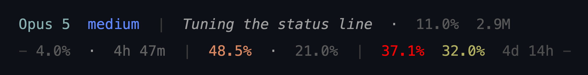
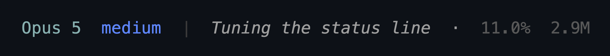

# statusline.py - uma status line de duas linhas pro Claude Code

[](https://github.com/capitulinojr/claude-statusline/actions/workflows/portability.yml)

Read this in [English](README.md).



```
<modelo> <esforco> | <sessao(italico)> · <ctx%> <tokens-sessao>
- <5h%> · <reset-5h> | <fable-dia%> · <dia-total%> | <fable%> <semana%> <reset-semanal> -
```

A linha de cima é esta sessão. A de baixo é a cota da conta. Tem uma terceira linha, com um espaço só, pra barra não encostar no prompt logo abaixo.

Nenhuma das duas tem rótulo. Posição e cor já dizem o que é. Tu lê de relance: em que modelo eu estou, quanto de contexto sobra, quanto de cota eu queimei.

Um arquivo, stdlib, zero dependências. Ele lê JSON do stdin e imprime duas linhas. Só.

---

## Instalação

**Requisitos:** Python 3.8+ no PATH. Mais nada.

### Modo rápido: manda o Claude Code instalar

Baixa o `statusline.py` e cola isto numa sessão:

> Instala esta status line: põe o `statusline.py` que eu baixei em `~/.claude/`, adiciona o bloco `statusLine` no meu `~/.claude/settings.json` apontando pro caminho absoluto dele com `python -S -E`, e roda `--selftest` pra confirmar. Me mostra o diff do settings antes de gravar.

Ele conhece o formato do bloco e acha o `settings.json` sozinho. O pedido do diff não é firula: é o teu arquivo de configuração, e um merge desatento apaga o que já estava lá.

### Modo manual: três passos

1. Salva o `statusline.py` onde tu quiser (ex.: `~/.claude/statusline.py`).
2. No `~/.claude/settings.json`, põe:

```json
{
  "statusLine": {
    "type": "command",
    "command": "python -S -E \"C:\\full\\path\\statusline.py\"",
    "padding": 0,
    "refreshInterval": 15
  }
}
```

No macOS/Linux, usa `python3 -S -E \"/path/statusline.py\"`. Os flags `-S -E` pulam o `site-packages` e as variáveis de ambiente `PYTHON*`: inicia mais rápido, e um `PYTHONPATH` sujo não quebra ele.

3. Confere: `python statusline.py --selftest` tem que imprimir `OK - selftest (318 checks, 0 failure(s))`.

---

## O que é cada campo

**Linha 1 - a sessão**



| Campo                    | O que é                                                                                                                                                                               |
| ------------------------ | ------------------------------------------------------------------------------------------------------------------------------------------------------------------------------------- |
| `Opus 5`                 | modelo, colorido por tier (Fable laranja e **negrito**, Opus ciano, Sonnet amarelo, Haiku azul). O sufixo de janela que o payload cola no nome (`Opus 5 (1M context)`) sai: o campo de contexto ao lado já diz a janela |
| `medium`                 | nível de reasoning effort (`low` … `ultracode`)                                                                                                                                       |
| `Tuning the status line` | nome da sessão, em itálico - o que tu pôs no `/rename`, ou o título que o Claude Code gerou. O script tira os caracteres de controle e trunca o texto antes de ele chegar no terminal |
| `11.0%`                  | **contexto** - % da janela inteira já ocupada. De 75% pra cima fica vermelho e o aviso `/compact` aparece do lado                                                                     |
| `2.9M`                   | tokens acumulados nesta sessão (input + output + cache)                                                                                                                               |

**Linha 2 - as cotas**


| Campo    | O que é                                                              |
| -------- | -------------------------------------------------------------------- |
| `4.0%`   | cota da janela de **5 horas**                                        |
| `4h 47m` | tempo até o reset das 5 horas                                        |
| `48.5%`  | **teto diário do Fable** (ver abaixo)                                |
| `21.0%`  | **teto diário da cota total** - mesmo racionamento, todos os modelos |
| `37.1%`  | quanto do teto do Fable (metade da cota semanal) já foi              |
| `32.0%`  | cota da janela **semanal**                                           |
| `4d 14h` | tempo até o reset semanal                                            |

Os dois últimos blocos têm um número do Fable e um do total cada, e os dois usam a **mesma ordem**: `Fable · total` no dia, `Fable total` na semana.
Campo sem dado por trás some da barra, então o número de campos varia. 
A posição é sempre relativa aos separadores `|`, nunca fixa.

### Termômetro: gradiente de cor por consumo projetado até o reset da janela

80% da cota semanal, no 7º dia, sai amarelo. 
Os mesmos 80% no 2º dia saem vermelho.

Não é bug. No dia 7 a projeção dá ~86: o ciclo está acabando junto contigo. 
No dia 2 a projeção passa de 250, e a cota acaba na quarta. 
Uma escala por valor pintaria os dois iguais, sendo que são situações **opostas**.

É como o combustível do carro. Meio tanque a 10 km de casa não quer dizer a mesma coisa que meio tanque a 400 km.

Por isso toda porcentagem que tem prazo (5 horas, dia, semana) é pintada pelo consumo **projetado** até o reset, e não pelo valor bruto:

```
projeção = consumo ÷ fatia do prazo já decorrida   (100 = cai exatamente no teto)
```

Termômetro (`SCALE_PACE`): cinza, azul, verde, amarelo, laranja, todos apagados, e **vermelho vivo de uma projeção de 135 pra cima** - ou seja, quando o ritmo atual estoura o teto com folga.

Três exceções, de propósito:

- **Contexto** fica no termômetro por valor (`SCALE_CTX`): vermelho de 75% pra cima, com o aviso `/compact` do lado.
- **Cota real acima de `PACE_HARD` (95%)** volta pro vermelho, tenha o ritmo que tiver. Ali o bloqueio chega antes do reset, e isso é acionável até na véspera.
- **Os dois campos do Fable têm escala própria** (`SCALE_FABLE`) e nunca ficam cinza, azul ou verde: laranja apagado o tempo todo, laranja vivo de uma projeção de 85, vermelho de 100. O Fable é o tier caro e o teto dele é metade da cota da semana, então o campo é feito pra ser legível desde o primeiro ponto gasto - não pra se diluir na barra até ser tarde. É por isso que o print lá em cima mostra `37.1%` em vermelho ao lado de um `32.0%` amarelo: mesma semana, mesmo prazo, réguas diferentes.

Sem um `resets_at` usável no payload não existe prazo pra medir contra. O campo cai pra escala por valor, e os campos que dependem de "quantos dias faltam" somem da barra em vez de virarem chute.

---

## Teto do Fable

O **teto** é o oficial da Anthropic. O que o script estima é quanto dele tu já gastou.

**O problema:** o Claude Code entrega a cota agregada (`seven_day.used_percentage`) e nunca diz quanto daquilo foi o Fable. 
Se tu orquestra com Fable e executa com Sonnet/Haiku, o número agregado não te conta se tu está queimando cota no tier errado.

**A estimativa:** o script varre os transcripts (`~/.claude/projects/**/*.jsonl`) da semana corrente. De cada entrada ele tira o **custo ponderado**, pelo preço do modelo daquela entrada: input, output, cache-write e cache-read pesam diferente. Aí projeta a fatia sobre o agregado oficial:

```
fable_share  = fable_cost / total_cost              (sobre os 7 dias)
fable_share  = fable_share × 1.382                  (calibração medida, ver abaixo)
pontos_gastos_pelo_fable = fable_share × seven_day.used_percentage
% do teto = pontos ÷ 50 × 100                       (FABLE_CAP_SHARE = 50%)
```

`FABLE_CAP_SHARE = 0.50` é o **limite declarado pela Anthropic** (conferido em 2026-07-29), não é chute: nos planos Max e Team Premium, o Fable 5 pode consumir *até metade* da tua cota semanal. Passou disso, ou tu segue no Fable com usage credits, ou troca de modelo pra ficar dentro do que sobrou. Daí a régua: 100% neste campo é o ponto em que o Fable deixa de estar incluído na assinatura. Vale enquanto a Anthropic mantiver esse limite - se o teu plano diz outra coisa (assento padrão de Team ou Enterprise, por exemplo, onde o Fable roda por crédito em vez de fatia incluída), ajusta a constante no topo do arquivo.

### Calibração contra o número oficial

Preço de API não é peso de cota. A fatia crua sai alta o bastante pra pintar a barra da cor errada, então ela é multiplicada por `FABLE_SHARE_CALIBRATION` antes de virar porcentagem do teto.

O valor que vai em `FABLE_SHARE_CALIBRATION` é **1,382**, de uma medição de fatia crua de 24,66% contra um oficial de 15% sobre 22% da cota. É um ponto empírico, não constante da natureza, e carrega margem de ~±0,08 só de arredondamento: a tela de usage serve inteiros, então "15%" é qualquer valor entre 14,5 e 15,5. A fatia crua soma a incerteza própria dela por cima.

Fator acima de 1 quer dizer que a fatia local **subestima** o Fable; abaixo de 1, superestima. A direção depende de quanto Fable roda fora desta máquina - claude.ai web, Cowork, outro device. Esse consumo conta na cota e não deixa transcript local, e a própria tela de usage avisa: o detalhamento dela é "based on local sessions on this machine", enquanto o teto no topo vem do servidor e enxerga tudo. Essa proporção não é fixa, então o fator também não é. Re-medir com regularidade, ou ligar a leitura oficial abaixo e deixar ele se re-medir sozinho.

Medir com a semana adiantada sempre que der: oficial grande estreita a margem, e fator medido contra porcentagem de um dígito é quase só ruído de arredondamento.

**O que o fator absorve.** Duas causas, que uma medição não separa:

1. o peso do Fable na cota ser menor que a razão de preço (hoje 2× o Opus);
2. consumo que conta na cota mas não deixa transcript local - claude.ai web, Cowork.

A segunda não tem direção garantida. Consumo ausente só infla a fatia se for *menos* rico em Fable que o local; sendo mais rico, a fatia local subestima; e com a mesma mistura, não enviesa nada. O mesmo fator absorve as duas enquanto as proporções ficarem estáveis, mas elas não apontam necessariamente pro mesmo lado. Daí a correção morar na **fatia**, e não no preço: assim ela não afirma qual das duas é.

**Onde está o número oficial:** o Claude Code não manda ele no payload (só `five_hour` e `seven_day`), mas o claude.ai mostra em **Settings > Usage**, e a API que alimenta aquela tela devolve os três limites num array `limits` - a entrada `weekly_all` é a cota total e a `weekly_scoped` com `scope.model.display_name: "Fable"` é o teto do Fable. A seção seguinte lê exatamente isso.

### Lendo o número oficial (opt-in)

O `claude_usage_fetch.py` vem junto com a statusline. Ele lê tua credencial OAuth do Keychain, busca `GET /api/oauth/usage` - o mesmo endpoint que o Claude Code usa no painel `/usage` dele - e guarda o resultado em cache. A barra então **exibe** o número oficial semanal do Fable em vez de estimar.

**Vem desligado.** Liga com:

```bash
export CLAUDE_STATUSLINE_USAGE_API=1
```

Com a variável desligada, o `claude_usage_fetch.py` nunca é chamado: nada é lido do teu Keychain e nada sai da máquina. Uma statusline não deve encostar nas tuas credenciais só porque consegue.

Com ela ligada:

- **O campo semanal do Fable vira leitura**, não estimativa: a porcentagem oficial vai pra barra sem passar por fatia nem por fator. A varredura dos transcritos ainda precisa dar certo, porém - ela alimenta o campo diário, e sem ela os dois campos do Fable somem juntos.
- **O fator de calibração se re-mede sozinho** a cada busca, contra a fatia local do mesmo instante. O `FABLE_SHARE_CALIBRATION` do fonte serve só de fallback pra quando não houver medição.
- **O campo diário do Fable segue estimativa.** A API entrega o recorte semanal por modelo e nada diário, então esse campo sai da fatia local, corrigida pelo fator auto-medido.

Como ele se comporta:

| | |
| --- | --- |
| atualização | a cada 10 min, casando com o TTL da varredura local pra que os dois lados do fator fiquem próximos no tempo; a fatia local é aceita com até 20 min, então são quase simultâneos, não simultâneos |
| validade | número de até 1h ainda é usado; passando disso a barra cai na estimativa |
| onde roda | processo destacado, nunca dentro do render - rede lenta não trava a barra |
| em caso de falha | o último número bom é preservado, o erro é registrado, e a próxima tentativa espera ao menos 2 min. Sessões concorrentes são serializadas por um lock no carimbo de tentativa, então várias sessões abertas ainda produzem uma busca só; sem `fcntl` (Windows) essa serialização é só best-effort |
| o token | lido, usado numa requisição à Anthropic, e nunca escrito no cache, no log ou no stdout |

Pra ver o que ele achou, rodando na mão:

```bash
CLAUDE_STATUSLINE_USAGE_API=1 python claude_usage_fetch.py --print
```

> **Ressalvas antes de ligar.** O `/api/oauth/usage` é o endpoint que o próprio Claude Code chama, mas não tem contrato público: pode mudar ou sumir sem aviso. Ele é tratado como não-confiável por desenho: falha nunca produz número errado - ela preserva a última leitura boa, que segue utilizável por até uma hora, e só então a barra cai na estimativa. O script também nunca renova o token OAuth; achando um vencido, pula a rodada e espera o CLI renovar.

### O teto diário do Fable amplifica o erro

O campo **semanal** responde de forma proporcional ao fator. O **diário**, não - e isso não é efeito da calibração, é a forma do racionamento. O teto do dia divide o **saldo** (`50 − o que o Fable gastou antes de hoje`), e perto do teto esse saldo é a diferença entre dois números quase iguais:

| fator | fatia | semanal | diário |
| --- | --- | --- | --- |
| 1,000 (cru) | 50,8% | 93,4% | **89,2%** |
| 0,920 | 46,7% | 86,0% | 51,4% |
| 0,894 | 45,4% | **83,5%** | **44,6%** |
| 0,800 | 40,6% | 74,7% | 28,7% |

A tabela ilustra a amplificação com a semana em 92% e **dois dias até o reset**; o número de dias entra no cálculo do teto, então faz parte da leitura, e os fatores listados são uma faixa, não um histórico. Um ponto de erro na fatia move o semanal ~1,8 ponto e o diário dezenas. **Lê o diário como ordem de grandeza, não como medida.** Deixar ele cru ao lado de um semanal calibrado seria pior - misturaria duas réguas na mesma barra.

> **A calibração vale só para a ponderação que a Anthropic pratica hoje.** Não é constante da natureza: eles podem re-ponderar a cota a qualquer momento, e quando fizerem isso o fator fica errado sem nada acusar. Nenhuma parte do script detecta isso; só re-medir detecta, seja a mão ou automaticamente.

**Re-medir** é ler os dois números na tela de usage, no mesmo instante, e rodar:

```bash
python statusline.py --calibrate 92 84    # <all%> <fable%>
```

Ele calibra contra a fatia semanal em cache, então precisa que a barra tenha renderizado nos últimos ~20 minutos, no mesmo dia. Fora disso ele recusa e diz o motivo, em vez de calibrar contra uma fatia velha - abre uma sessão, deixa a barra desenhar uma vez e roda de novo.

Ele compara com a fatia crua desta máquina e imprime o `FABLE_SHARE_CALIBRATION` que faz bater. Fator `1.0` desliga a correção e devolve o comportamento antigo.

### O teto diário se mexe

Queima dois dias de uma vez numa terça e o teto de quarta já nasce menor, então a porcentagem sobe mais rápido. Estourar o orçamento de hoje não mexe no número de hoje. **Estreita** os dias seguintes.

```
teto_de_hoje = (50 pontos − o que o Fable gastou ANTES de hoje) ÷ dias até o reset (contando hoje)
```

Foi a parte chata, e é o que faz o número servir pra alguma coisa. Três detalhes:

- **O teto é fixado à meia-noite**, não recalculado a cada gasto. Se ele encolhesse junto com o consumo, a régua nunca chegaria a 100%.
- **O dia do reset conta inteiro.** Na véspera, o dia herda todo o saldo que restou. O que sobrou é gastável até a hora do reset, e racionar isso por fração não faria sentido.
- **Não tem teto em 100%.** Passar da fatia do dia é legítimo e tem que aparecer. Sem saldo nenhum ao acordar, o dia nasce em 100%.

A cor desses dois campos também vem do ritmo, medida contra o **fim do dia**. E no dia do reset semanal o "dia" é recortado pela semana, não pela meia-noite: se o reset é ao meio-dia, o dia-cota da manhã termina às 12:00 e o da tarde começa às 12:00. Sem esse recorte, 80% do teto às 11:00 projetaria 175% (vermelho) em vez de ~87%. O recorte casa com a medição, que também só enxerga gasto desde o início da semana.

**Por que estimar em vez de ler o número oficial?** Porque ele não existe no payload. A [doc da status line](https://code.claude.com/docs/en/statusline) expõe só `rate_limits.five_hour` e `rate_limits.seven_day`, sem quebra por modelo (conferido em 2026-07-26; se aparecer um dia, troca a estimativa por ele). E a ponderação real também não dá pra reconstruir: a Anthropic publica a cota em *horas de modelo*, com faixas largas (Max 5x: 15-35h de Opus por semana), nunca como peso por token.

Então: o **teto** dos dois números é oficial, e a posição dentro dele é estimativa calibrada. Uma bússola, não contabilidade.

O que sobra de erro depois da calibração tem causa conhecida, e nenhuma constante resolve: a Anthropic raciona por horas de modelo, o script pondera por custo em dólar. O fator encosta os dois num ponto de operação, e é só isso que ele faz - não transforma um proxy no outro. Mudando muito a mistura de modelos, a diferença volta a abrir.

O painel do Claude Code (`/usage`) mostra o número oficial do Fable, que o payload não entrega. Se tu quiser o valor exato, é lá. A barra é pra tu não precisar olhar - e com a [leitura oficial](#lendo-o-número-oficial-opt-in) ligada ela mostra esse mesmo número sem tu abrir o painel.

Dois detalhes do payload que valem pra qualquer status line. O `rate_limits` só aparece pra assinante Pro/Max **depois da primeira resposta da API na sessão**, e cada janela pode faltar sozinha - por isso tudo aqui passa por `safe()`. E o `context_window.used_percentage` é calculado **só com os tokens de input** (`input + cache_creation + cache_read`, sem `output_tokens`); o fallback do script usa a mesma fórmula pra não divergir do número oficial.

**Não usa o modelo caro, ou só quer as cotas oficiais?** Faz `fable_cap_percent()` e `daily_total_percent()` retornarem `None` na primeira linha. Os três campos somem e a varredura dos transcripts para de rodar.

Apagar os campos do `render()` não basta: as duas funções já teriam sido chamadas, e são elas que disparam a varredura. O que custa é a chamada, não o display.

---

## Ajustes

Tudo que tu ia querer mudar mora nas constantes do topo, cada uma com um comentário:

- `MODEL_COLORS`, `EFFORT_COLORS` - cores por modelo e por effort (xterm-256).
- `SCALE_PACE`, `SCALE_CTX`, `SCALE_FABLE` - os termômetros. Cada um é uma tupla de `(limite superior exclusivo, código SGR)` mais uma cor de alerta acima de tudo. O número que entra no `SCALE_PACE` é a **projeção**, não o consumo. Mexer nos limiares dele é mexer em "a partir de quanto fora do ritmo conta como fora do ritmo". `SCALE` é só o fallback pra quando o payload não traz prazo.
- `PACE_FLOOR_WINDOW` (0.15) e `PACE_FLOOR_DAY` (0.35) - piso do denominador da projeção. No começo de uma janela, extrapolar é ruído (2% gastos sobre 1% do tempo projetariam 200%), então antes desse ponto a janela conta como se o piso já tivesse decorrido. O piso do dia é maior porque o dia do calendário começa à meia-noite e o uso humano não.
- `PACE_HARD` (95) - acima disso, cota real volta a ser pintada por valor.
- `RESET_TOLERANCE` (300 s) - folga pra aceitar um `resets_at` recém-vencido, já que o payload demora alguns segundos pra virar depois do reset.
- `SCAN_DEADLINE` (8 s) - orçamento de tempo da varredura dos transcripts. Passou disso, a estimativa da rodada é descartada e vale o último cache, mesmo velho.
- `PRICES` - USD por 1M tokens, casados pelo prefixo do id do modelo. **Confere as tabelas de preço antes de confiar no número** (as do arquivo foram verificadas em julho de 2026); o casamento é por prefixo, então a ordem das entradas importa.
- `FABLE_CAP_SHARE` - a fatia da cota semanal que o Fable pode ocupar (0.50 = o limite oficial no Max/Team Premium).
- `FABLE_SHARE_CALIBRATION` (1.382) - correção empírica da fatia estimada do Fable, medida contra o número oficial. Re-medir com `--calibrate`; `1.0` desliga. Com a leitura oficial ligada ele é contornado no campo semanal e substituído no diário sempre que houver medição fresca; quando a fatia local falta ou é de outro período, não há medição possível e o diário usa esta constante.
- `USAGE_API_ENV` / `CLAUDE_STATUSLINE_USAGE_API` - põe `1` pra ler o número oficial por modelo em vez de estimar. Desligado por padrão.
- `OFFICIAL_TTL` (600 s) e `OFFICIAL_MAX_AGE` (3600 s) - de quanto em quanto tempo o oficial é re-buscado, e quão velho ele pode ficar antes de a barra cair na estimativa.
- `OFFICIAL_SPAWN_FLOOR` (120 s) - intervalo mínimo entre duas tentativas de busca, pra rede caída não gerar processo a cada refresh.
- `CTX_HINT` - o texto que aparece quando o contexto passa de 75%.
- `QUOTA_DASHES` - o risquinho que abre e fecha a segunda linha.

---

## Limitações

A projeção é linear e o uso humano vem em rajada, então ela lê pessimista de manhã e otimista de madrugada. Os pisos só cortam a explosão numérica do começo da janela; dentro deles a cor não anda com o relógio. Calibrar uma curva por horas ativas exigiria histórico de uso.

`PACE_HARD` é degrau, não gradiente. 94.9% projetando 95.9 sai amarelo, e 95.0% vai pro vermelho na hora. É de propósito: perto do bloqueio, o valor absoluto toma a cor de volta.

O script lê o relógio várias vezes por render (`time.time()`, `day_start()`). Um render que atravessa a meia-noite pode misturar a fatia de um dia com o custo do outro. Uma barra torta por dia, até o refresh seguinte.

Entrada datada à frente do relógio conta como de hoje. Isso é escolha, não descuido: recusar foi testado e ficou pior. Entrada recusada continua contando no total da semana e sai só do total do dia, então uma máquina alguns minutos adiantada - ou transcrito sincronizado de uma - empurrava os dois campos do dia pra um `0.0%` medido ao lado de uma cota semanal em 68%. Contar superestima o teto do dia, que é o erro barulhento e conservador. Recusar subestima, que é o silencioso - e num medidor o erro silencioso é o que deixa a pessoa estourar o limite achando que está tranquila.

O `SCAN_DEADLINE` é conferido **entre** arquivos, não dentro de um. Um `.jsonl` muito grande é lido até o fim antes de o orçamento ser olhado de novo, então os 8 segundos são alvo, não teto. E quando o orçamento estoura sem cache pra cair, o trabalho parcial é descartado em vez de salvo: os três campos derivados não aparecem e o render seguinte recomeça do zero. Histórico suficiente num disco lento o bastante e isso vira o estado estável - a barra segue funcionando, só que os três campos do Fable e do dia nunca aparecem. Se for o teu caso, a saída é a mesma da seção acima: fazer `fable_cap_percent()` e `daily_total_percent()` devolverem `None`, e a varredura para de rodar.

O que ele garante: nunca derruba a sessão. Cada pedaço da barra roda dentro de um `safe()`, e o que falha vira string vazia e some sem deixar buraco. Payload vazio ou inválido imprime linha em branco, não stack trace.

---

## Detalhes de implementação que valem saber

- **O payload vem de fora, então é tratado como hostil.** `(x or {}).get(...)` só protege contra `None`. Um `"model": "bad"` passa reto e estoura no meio do render, apagando a barra inteira. Todo acesso aninhado passa por `as_dict`/`as_text`, e todo número por `finite_number`. Ele rejeita `bool` (um `int` em Python) e `NaN`/`Infinity`, que o `json.loads` aceita por padrão. `NaN` foi o pior: ele sobrevive ao clamp e sai pelo lado errado - `min(100.0, nan)` devolve `100.0` - e teria virado um alerta falso de cota cheia.
- **Prazo implausível é tratado como prazo ausente.** Um `resets_at` no passado, zerado, ou a 99 dias não é prazo ruim, é dado inválido. Montar uma janela em cima dele fabrica um número com cara de medido: um teto diário montado sobre um "faltam 7 dias" chutado nasce num vermelho 100% que não mede nada.
- **Com os transcripts é igual.** São arquivos de outro programa, não um contrato: contador de token chega como string, negativo ou `NaN` com a mesma facilidade, então cada um é limpo antes de entrar numa soma. Um `NaN` sozinho envenenaria todas as somas seguintes, em silêncio.
- **Nada escrito pro terminal é confiável.** O nome da sessão é escrito por outro alguém: tu, ou o modelo resumindo a conversa. Solto num terminal, um `ESC` ali não é caractere, é comando. Ele move o cursor, renomeia a janela, abre um hyperlink OSC-8. E um `\n` sozinho quebraria o layout de duas linhas, que é o contrato inteiro desta barra.
- **UTF-8 dos dois lados.** Rodando como subprocess (sem console anexado), o Python cai na codepage ANSI do sistema, cp1252 no Windows. Isso corrompe a saída (o `·` sai como byte cru) e a **entrada** (um nome de sessão com acento vira `implementação`, o double-encode clássico). Por isso o script lê `sys.stdin.buffer` e decodifica UTF-8 explícito, e força `sys.stdout.reconfigure(encoding="utf-8")`. Se tu mexer nessa parte, confere por **byte**, não olhando pra tela - e não testa por pipe do PowerShell, ele re-encoda e falseia o resultado.
- **Leitura ao contrário dos `.jsonl`.** Transcript cresce; o script lê de trás pra frente em blocos de 256 KB e para assim que sai da janela de tempo. Antes de abrir qualquer arquivo ele filtra por `mtime`: a varredura semanal só toca no que foi modificado dentro da janela.
- **A varredura é recursiva.** Transcript de subagente e de workflow não fica ao lado do da sessão: vai pra subpasta. Se tu orquestra com subagentes, a maior parte do teu consumo mora lá - numa medição real, **63%** do volume. Varrer só o primeiro nível inflava a fatia do modelo caro, porque o denominador perdia justamente o trabalho barato delegado.
- **Cache de 10 minutos** pra fatia semanal, em `~/.claude/statusline-week-share.json`, invalidado quando o dia vira. Sem ele a varredura rodaria a cada refresh. Ele mora no teu próprio diretório em vez da pasta temporária do sistema, de propósito: em máquina compartilhada o `/tmp` é de todo mundo, um nome fixo colide entre usuários e abre o vetor clássico do symlink plantado. A escrita é atômica (arquivo temporário + `os.replace`), porque várias sessões do Claude Code renderizam ao mesmo tempo e escrevem esse mesmo arquivo.
- **Deduplicação de streaming:** entradas parciais de streaming seriam contadas duas vezes; o script guarda só as que têm `stop_reason` preenchido (mais a última, se ela vier como `null`).
- **Datas do transcript.** O timestamp vem com sufixo `Z`, que o `datetime.fromisoformat` só passou a aceitar no Python 3.11. No 3.8-3.10 isso viraria todo timestamp em `None` **em silêncio**: os tetos diários ficariam em 0.0% com a barra inteira parecendo funcionar. O script normaliza o sufixo e mantém um fallback por `strptime`.

### Diagnóstico

Liga o `CLAUDE_STATUSLINE_DEBUG=1` e cada render grava o payload que recebeu em `~/.claude/statusline-payload.json`. É o jeito mais rápido de descobrir quais campos o Claude Code manda, ou não manda, na tua versão.

Vem **desligado** de propósito: o payload carrega o nome da tua sessão e caminhos do teu disco, e gravar isso a cada 15 segundos é decisão tua, não default de biblioteca.

---

## Testes

```bash
python statusline.py --selftest     # checks internos, 0 dependências
python statusline.py --calibrate 92 84   # re-mede o fator do Fable: <all%> <fable%>
```

Ele imprime quantos checks rodaram: `OK - selftest (318 checks, 0 failure(s))`. A contagem está ali porque um `0 falha(s)` sozinho sairia exatamente igual se a bateria inteira tivesse sido apagada. No Windows sai um a menos: o check de modo de arquivo só quer dizer alguma coisa onde existe permissão POSIX.

Cobrem formatação de duração e de token, os termômetros, inferência da janela de contexto, a aritmética dos dois tetos (semana limpa, dia anterior estourado, véspera do reset, saldo zerado), decodificação do payload e a montagem das duas linhas. E mais, com arquivo temporário de verdade: o leitor reverso, a deduplicação de streaming, a janela de tempo, o custo ponderado e o cache em disco.

Pra ver um render real com o teu próprio payload:

```python
import subprocess, pathlib
raw = (pathlib.Path.home() / '.claude' / 'statusline-payload.json').read_bytes()
print(subprocess.run(['python', 'statusline.py'], input=raw, capture_output=True).stdout.decode('utf-8'))
```

(Esse arquivo só existe depois que tu ligou o `CLAUDE_STATUSLINE_DEBUG=1`.)

As três imagens desta página são geradas, não capturadas:

```bash
python docs/make-screenshots.py            # reescreve os três PNGs
python docs/make-screenshots.py --selftest # testa o próprio gerador
```

Ele importa o `statusline.py` e fotografa o que o `render()` devolver, então
mudança de cor, de separador ou de campo chega nas imagens na rodada seguinte.
Só os números das cotas e os timers de reset ficam fixados. Precisa de um
browser da família Chromium em modo headless; se ele não achar sozinho, aponta o
`CHROME` pra um.

---

## Licença

MIT - ver [LICENSE](LICENSE).

---

Projeto independente, sem afiliação nem endosso da Anthropic. "Claude" e "Claude Code" são deles; aparecem aqui pra dizer em que isso se encaixa.
